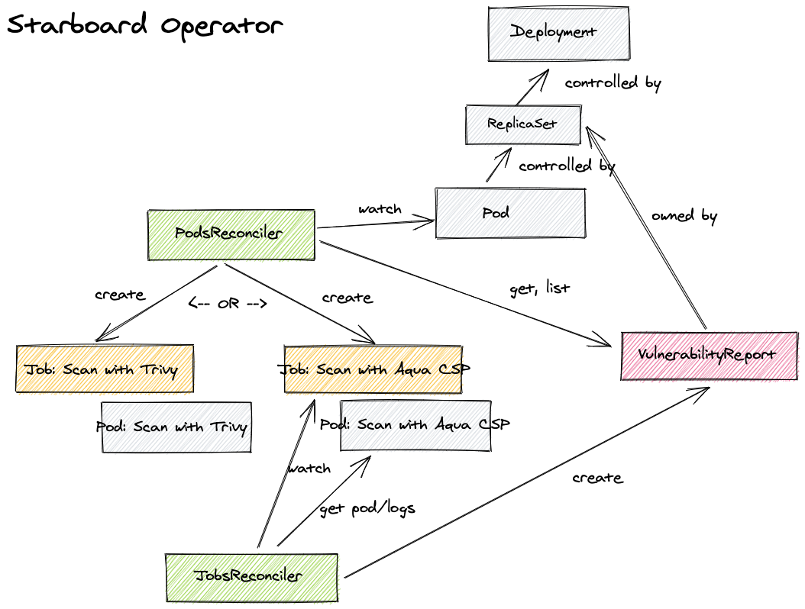

# starboard-operator

[![GitHub Release][release-img]][release]
[![GitHub Build Actions][build-action-img]][actions]
[![Coverage Status][cov-img]][cov]
[![Go Report Card][report-card-img]][report-card]
[![License][license-img]][license]
![Docker Pulls][docker-pulls]

This operator for Starboard automatically updates security report resources in response to workload and other changes on
a Kubernetes cluster - for example, initiating a vulnerability scan when a new pod is started. Please see the main
[Starboard][starboard] repo for more info about the Starboard project.

## Table of Contents

- [Configuration](#configuration)
- [Install modes](#install-modes)
- [Vulnerability scanners](#vulnerability-scanners)
- [Contributing](#configuration)
- [How does it work?](#how-does-it-work)

## Configuration

Configuration of the operator is done via environment variables at startup.

| NAME                                    | DEFAULT  | DESCRIPTION |
| --------------------------------------- | -------- | ----------- |
| `OPERATOR_NAMESPACE`                    | N/A      | See [Install modes](#install-modes) |
| `OPERATOR_TARGET_NAMESPACES`            | N/A      | See [Install modes](#install-modes) |
| `OPERATOR_SCAN_JOB_TIMEOUT`             | `5m`     | The length of time to wait before giving up on a scan job |
| `OPERATOR_METRICS_BIND_ADDRESS`         | `:8080`  | The TCP address to bind to for serving [Prometheus][prometheus] metrics. It can be set to `0` to disable the metrics serving. |
| `OPERATOR_LOG_DEV_MODE`                 | `false`  | The flag to use (or not use) development mode (more human-readable output, extra stack traces and logging information, etc). |
| `OPERATOR_SCANNER_TRIVY_ENABLED`        | `true`   | The flag to enable Trivy vulnerability scanner |
| `OPERATOR_SCANNER_TRIVY_VERSION`        | `0.11.0` | The version of Trivy to be used |
| `OPERATOR_SCANNER_AQUA_CSP_ENABLED`     | `false`  | The flag to enable Aqua CSP vulnerability scanner |
| `OPERATOR_SCANNER_AQUA_CSP_VERSION`     | `5.0`    | The version of Aqua CSP scannercli container image to be used |

## Install modes

The values of the `OPERATOR_NAMESPACE` and `OPERATOR_TARGET_NAMESPACES` determine the install mode,
which in turn determines the multitenancy support of the operator.

| MODE            | OPERATOR_NAMESPACE | OPERATOR_TARGET_NAMESPACES | DESCRIPTION |
| --------------- | ------------------ | -------------------------- | ----------- |
| OwnNamespace    | `operators`        | `operators`                | The operator can be configured to watch events in the namespace it is deployed in. |
| SingleNamespace | `operators`        | `foo`                      | The operator can be configured to watch for events in a single namespace that the operator is not deployed in. |
| MultiNamespace  | `operators`        | `foo,bar,baz`              | The operator can be configured to watch for events in more than one namespace. |
| AllNamespaces   | `operators`        |                            | The operator can be configured to watch for events in all namespaces. |

## Vulnerability scanners

To enable Aqua CSP as vulnerability scanner set the value of the `OPERATOR_SCANNER_AQUA_CSP_ENABLED` to `true` and
disable the default Trivy scanner by setting `OPERATOR_SCANNER_TRIVY_ENABLED` to `false`.

To configure the Aqua CSP scanner create the `starboard-operator` secret in the `operators` namespace:

```
$ kubectl create secret generic starboard-operator \
 --namespace $OPERATOR_NAMESPACE \
 --from-literal OPERATOR_SCANNER_AQUA_CSP_USERNAME=$AQUA_CONSOLE_USERNAME \
 --from-literal OPERATOR_SCANNER_AQUA_CSP_PASSWORD=$AQUA_CONSOLE_PASSWORD \
 --from-literal OPERATOR_SCANNER_AQUA_CSP_VERSION=$AQUA_VERSION \
 --from-literal OPERATOR_SCANNER_AQUA_CSP_HOST=http://csp-console-svc.aqua:8080
```

## Contributing

Thanks for taking the time to join our community and start contributing!

- See [CONTRIBUTING.md](CONTRIBUTING.md) for information about setting up your development environment and deploying the operator.
- Check out the [open issues](https://github.com/aquasecurity/starboard-operator/issues).

## How does it work?



[release-img]: https://img.shields.io/github/release/aquasecurity/starboard-operator.svg?logo=github
[release]: https://github.com/aquasecurity/starboard-operator/releases
[build-action-img]: https://github.com/aquasecurity/starboard-operator/workflows/build/badge.svg
[actions]: https://github.com/aquasecurity/starboard-operator/actions
[cov-img]: https://codecov.io/github/aquasecurity/starboard-operator/branch/master/graph/badge.svg
[cov]: https://codecov.io/github/aquasecurity/starboard-operator
[report-card-img]: https://goreportcard.com/badge/github.com/aquasecurity/starboard-operator
[report-card]: https://goreportcard.com/report/github.com/aquasecurity/starboard-operator
[license-img]: https://img.shields.io/github/license/aquasecurity/starboard-operator.svg
[license]: https://github.com/aquasecurity/starboard-operator/blob/master/LICENSE
[docker-pulls]: https://img.shields.io/docker/pulls/aquasec/starboard-operator?logo=docker

[starboard]: https://github.com/aquasecurity/starboard
[prometheus]: https://github.com/prometheus
